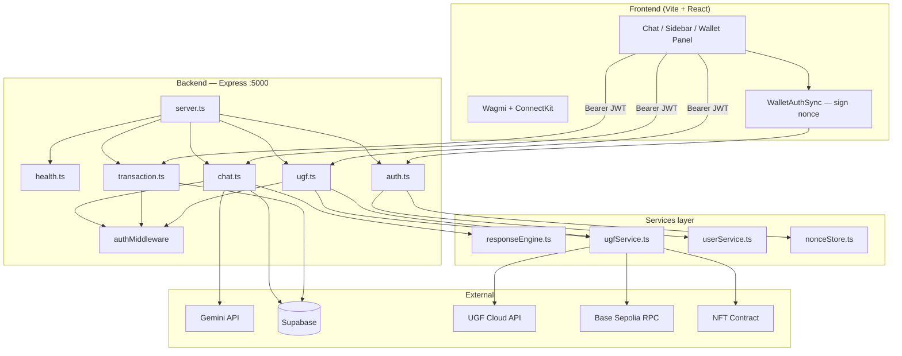
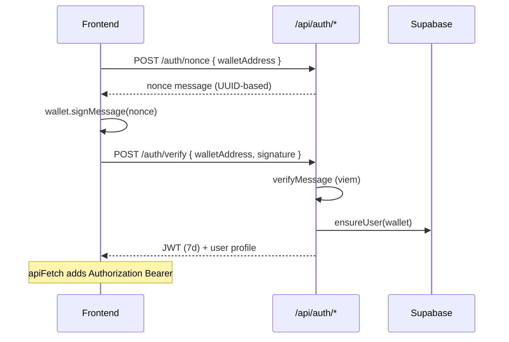
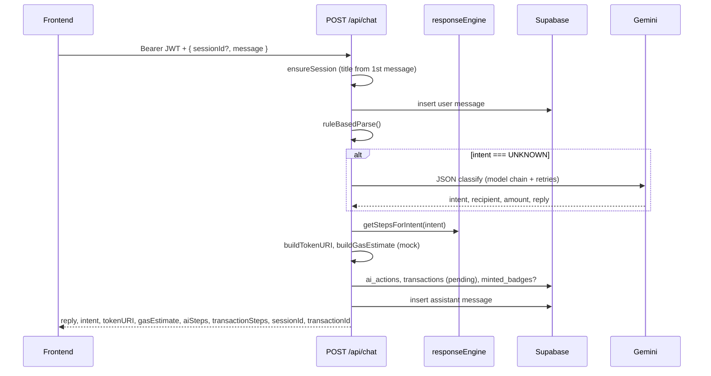
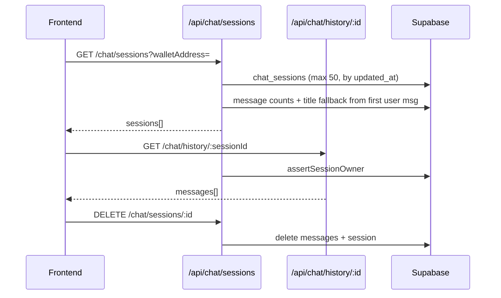
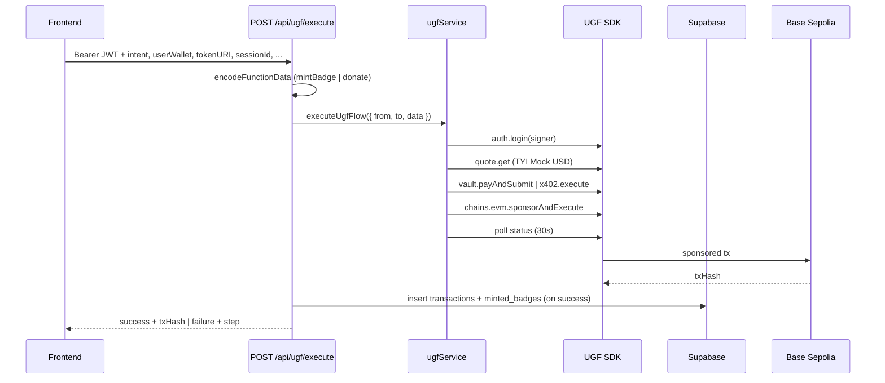

# UGF AgentX — Backend Implementation Status

| | |
| --- | --- |
| **Scope** | Backend only (`/Backend`) |
| **Reference** | `UGF_AgentX_Hackathon_Plan_260518_120803.pdf` |
| **Last updated** | May 19, 2026 |
| **Source of truth** | `Backend/src/` + `server.ts` route mounting |

---

## Table of Contents

1. [Executive Summary](#executive-summary)
2. [Status Legend](#status-legend)
3. [Architecture](#architecture)
4. [Tech Stack](#tech-stack)
5. [API Endpoints](#api-endpoints)
6. [Implemented (Detail)](#implemented-detail)
7. [Partially Implemented](#partially-implemented)
8. [Remaining Work (Detail)](#remaining-work-detail)
9. [Database Schema](#database-schema)
10. [Environment Variables](#environment-variables)
11. [Frontend ↔ Backend Integration](#frontend--backend-integration)
12. [Judge Demo Checklist](#judge-demo-checklist)
13. [File Inventory](#file-inventory)
14. [Quick Start](#quick-start)

---

## Executive Summary

| Area | Progress | Notes |
| --- | --- | --- |
| **Server & middleware** | **100%** | Express, CORS, logging, global errors |
| **Wallet auth (JWT)** | **95%** | Nonce + signature + Bearer on protected routes |
| **Chat & intent** | **95%** | Rule parser + Gemini fallback + persistence |
| **Chat sessions API** | **100%** | List, history, delete, auto-title on first message |
| **Timeline steps in chat** | **100%** | `aiSteps` + `transactionSteps` via `responseEngine.ts` |
| **Transaction / gallery / wallet APIs** | **90%** | CRUD + reads; some routes lack auth |
| **UGF on-chain execution** | **75%** | Live in `src/`; needs env, contract, E2E demo |
| **Smart contract in repo** | **0%** | No Solidity / deployed ABI checked in |
| **Production hardening** | **40%** | No Zod, partial env validation |

**Overall backend readiness:** ~**78%** for hackathon MVP (chat + auth + DB strong; on-chain path code-complete but ops-dependent).

### What works today

- Wallet login: `POST /api/auth/nonce` → sign → `POST /api/auth/verify` → JWT
- Authenticated chat: intent, reply, gas estimate (mock formula), Base64 `tokenURI`, timeline steps
- Session sidebar: `GET /api/chat/sessions`, `GET /api/chat/history/:id`, `DELETE /api/chat/sessions/:id`
- Transaction history, NFT gallery, wallet summary (DB-backed)
- `POST /api/ugf/execute` — full quote → settle → execute → poll (when env + contract configured)

### What still blocks a polished judge demo

- ERC721 contract source + verified `NFT_CONTRACT_ADDRESS` on Base Sepolia
- UGF credentials (`UGF_API_KEY`, signer key matching user wallet or demo wallet funded)
- Chat gas estimate still **formula-based**, not live UGF `quote.get()` preview
- Updating the **same** `transactions` row from chat → UGF execute (today chat creates `pending`, UGF may insert another row)
- On-chain ETH / Mock USD balance sync to `users` table
- `analytics` table unused; `intentParser.ts` legacy file unused

---

## Status Legend

| Icon | Status | Meaning |
| --- | --- | --- |
| ✅ | **Done** | Implemented in active `src/` and mounted |
| ⚠️ | **Partial** | Works with limits, mock data, or not fully wired E2E |
| ❌ | **Missing** | Not implemented or not used |
| 🔒 | **Auth** | Requires `Authorization: Bearer <jwt>` |

---

## Architecture

### System context

UGF AgentX uses a **standalone Express API** (port 5000), not Next.js API routes. The Vite/React frontend calls this API with a JWT after wallet signature login. Supabase (Postgres) is the system of record for users, chats, transactions, and badges. On-chain actions go through **UGF testnet SDK** (`@tychilabs/ugf-testnet-js`) on **Base Sepolia**, targeting an ERC721-style contract via `mintBadge` / `donate` calldata.

### High-level diagram



### Layer responsibilities

| Layer | Files | Responsibility |
| --- | --- | --- |
| **HTTP** | `server.ts`, `routes/*` | Routing, request validation (minimal), JSON responses |
| **Auth** | `auth.ts`, `authMiddleware.ts`, `nonceStore.ts` | Wallet nonce, viem `verifyMessage`, JWT issue/verify |
| **Chat** | `routes/chat.ts` | Intent parse, Gemini fallback, session/message CRUD, metadata, mock gas |
| **Timeline** | `services/responseEngine.ts` | Per-intent `aiSteps` + `transactionSteps` templates |
| **Chain** | `routes/ugf.ts`, `services/ugfService.ts` | Calldata build, UGF quote/settle/execute, status poll |
| **Data** | `config/supabase.ts`, `services/userService.ts` | Supabase admin client, user upsert |
| **Cross-cutting** | `middleware/cors.ts`, `errorHandler.ts`, `logger.ts` | CORS, `AppError`, request logs |

### Wallet authentication flow



### Chat message flow (implemented)



### Chat sessions sidebar flow (implemented)



### UGF execution flow (implemented in code; ops-dependent)



### PDF vs actual architecture

| Aspect | Hackathon PDF | Actual backend | Match |
| --- | --- | --- | --- |
| API host | Next.js API routes | Express 4 @ :5000 | ⚠️ Different host, same REST shape |
| Auth | Wallet connect | Nonce + signature + JWT | ✅ Stronger than PDF |
| Intent | Rule-based | Rule + Gemini JSON fallback | ✅ |
| AI provider | OpenAI | Google Gemini | ⚠️ Equivalent role |
| Database | Supabase | Supabase service role | ✅ |
| Gasless tx | UGF SDK | `ugfService.ts` + route mounted | ✅ Code ready |
| Contract | Solidity ERC721 | External address only | ❌ Not in repo |

---

## Tech Stack

| Layer | Technology | Status | Used in |
| --- | --- | --- | --- |
| Runtime | Node.js (ESM) | ✅ | `server.ts` |
| Framework | Express 4 | ✅ | All routes |
| Language | TypeScript ~5.8 | ✅ | `src/` |
| Database | Supabase (Postgres) | ✅ | All persistence |
| AI | `@google/generative-ai` | ✅ | `chat.ts` |
| Auth | `jsonwebtoken`, `viem` | ✅ | `auth.ts`, middleware |
| Blockchain | `@tychilabs/ugf-testnet-js` | ✅ | `ugfService.ts` |
| Blockchain | `viem` | ✅ | Auth verify, UGF calldata |
| Blockchain | `ethers` Wallet | ✅ | UGF signer in `ugfService.ts` |
| Validation | Zod | ❌ | In package.json, unused |
| Legacy | `openai` | ❌ | Not imported |

---

## API Endpoints

### Public

| Method | Endpoint | Description |
| --- | --- | --- |
| `GET` | `/health` | Liveness `{ status: "ok" }` |
| `POST` | `/api/auth/nonce` | Issue sign-in message for wallet |
| `POST` | `/api/auth/verify` | Verify signature, return JWT + user |

### Protected (🔒 `Authorization: Bearer <token>`)

| Method | Endpoint | Description |
| --- | --- | --- |
| `POST` | `/api/chat` | Parse message, persist, return reply + steps + metadata |
| `GET` | `/api/chat/sessions?walletAddress=` | List sessions (50 max), titles, message counts |
| `DELETE` | `/api/chat/sessions/:sessionId` | Delete session + all messages (owner only) |
| `GET` | `/api/chat/history/:sessionId` | Messages oldest → newest (owner only) |
| `POST` | `/api/transaction` | Create transaction row manually |
| `GET` | `/api/transactions/:walletAddress` | Transaction history for wallet |
| `GET` | `/api/gallery/:walletAddress` | Minted badges / NFT metadata |
| `GET` | `/api/wallet?walletAddress=` | User row (balances from DB) |
| `POST` | `/api/ugf/execute` | UGF quote → settle → execute on-chain |

### Unauthenticated (gap)

| Method | Endpoint | Issue |
| --- | --- | --- |
| `GET` | `/api/transaction/history/:sessionId` | No JWT; only checks session exists |

---

## Implemented (Detail)

### 1. Server foundation — ✅ 100%

- Express bootstrap, JSON body parser, URL-encoded support
- CORS from `FRONTEND_URL` (comma-separated origins)
- Per-request logging (`METHOD path`)
- Global `errorHandler` with `AppError` (400/403/500)
- 404 JSON for unknown routes
- `validateConfig()` warns on missing Gemini / Supabase keys (non-fatal)

### 2. Wallet authentication — ✅ 95%

**Files:** `routes/auth.ts`, `middleware/authMiddleware.ts`, `services/nonceStore.ts`, `services/userService.ts`

| Feature | Detail |
| --- | --- |
| Nonce | `POST /api/auth/nonce` — validates address (viem `isAddress`), stores in-memory nonce |
| Verify | `POST /api/auth/verify` — `verifyMessage`, creates/loads user in `users` |
| JWT | 7-day token: `{ walletAddress, userId }` signed with `JWT_SECRET` |
| Middleware | `authMiddleware` on chat, transaction, ugf routes |
| Wallet match | `assertWalletAccess` — query/path wallet must match JWT address |

**Not done:** refresh tokens, nonce persistence across server restarts (in-memory only), rate limiting.

### 3. Chat API — ✅ 95%

**File:** `routes/chat.ts` (~890 lines)

#### Intents

| Intent | Triggers | Action type in DB |
| --- | --- | --- |
| `MINT_BADGE` | mint, badge | `mint_badge` |
| `CLAIM_CERT` | claim, certificate, cert | `claim_cert` |
| `DONATE` | donate, donation, contribute | `donate` |
| `SEND_REWARD` | reward, tip, bonus | `send_reward` |
| `UNKNOWN` | — | Gemini fallback or help reply |

#### Entity extraction

- ETH address: `0x` + 40 hex
- Name recipient: `for|to|recipient <name>`
- Amount: number before USD / USDC / Mock USD

#### Session lifecycle

- `ensureSession()` — creates UUID session or reuses valid `sessionId`
- **Auto-title:** first message → `deriveSessionTitle()` (40 chars + `...`)
- Upsert updates `updated_at` on each message
- Owner checks via `assertSessionOwner()` on history/delete

#### `POST /api/chat` response fields

| Field | Source |
| --- | --- |
| `reply` | Rule template or Gemini |
| `intent`, `recipient`, `amount`, `confidence` | Parser |
| `tokenURI` | Base64 JSON + SVG (`buildTokenURI`) for mint/claim |
| `gasEstimate` | **Mock formula** (`buildGasEstimate`) — not UGF quote API |
| `aiSteps`, `transactionSteps` | `getStepsForIntent()` |
| `sessionId`, `transactionId` | DB inserts |

#### Persistence pipeline

1. Ensure session (+ title if new)
2. Insert `chat_messages` (user)
3. Parse intent (rules → Gemini if UNKNOWN)
4. Insert `ai_actions`
5. Insert `transactions` (status `pending`)
6. Insert `minted_badges` if `MINT_BADGE`
7. Insert `chat_messages` (assistant)

### 4. Chat sessions API — ✅ 100%

| Endpoint | Behavior |
| --- | --- |
| `GET /api/chat/sessions` | Max 50 sessions, `updated_at DESC`, `messageCount`, title fallback from first user message |
| `GET /api/chat/history/:sessionId` | Full thread, ownership enforced |
| `DELETE /api/chat/sessions/:sessionId` | Cascading delete messages then session |

### 5. Transaction timeline — ✅ 100%

**File:** `services/responseEngine.ts`

- Per-intent flows: `MINT_BADGE`, `CLAIM_CERT`, `DONATE`, `SEND_REWARD`, `UNKNOWN`
- `aiSteps`: timed assistant narration for chat UI
- `transactionSteps`: UGF pipeline labels (quote, settle, execute, confirm, save)
- Returned on every successful `POST /api/chat` (non-UNKNOWN gets full tx steps)

### 6. Gemini AI fallback — ✅ ~90%

- JSON mode + brace-extraction fallback
- Model chain: `GEMINI_MODEL` env → gemini-2.0-flash → 1.5-flash-latest → 1.5-pro
- Retries on 429/5xx (`GEMINI_MAX_RETRIES`, `GEMINI_RETRY_DELAY_MS`)
- Skips cleanly if no API key
- Confidence: `rule-based` | `GeminiAI` | `failed`

### 7. NFT metadata (off-chain) — ✅ 90%

- SVG badge/certificate in `buildSvg()`
- `data:application/json;base64,...` token URI
- Traits: Type, Recipient, Issued By, Network (Base Sepolia)

### 8. Transaction, gallery, wallet APIs — ✅ 90%

| Endpoint | Purpose |
| --- | --- |
| `POST /api/transaction` | Manual tx row create |
| `GET /api/transactions/:walletAddress` | Wallet tx history |
| `GET /api/gallery/:walletAddress` | `minted_badges` list |
| `GET /api/wallet` | User profile + DB balances |

### 9. UGF on-chain execution — ✅ 75% (code complete)

**Files:** `routes/ugf.ts`, `services/ugfService.ts`

| Step | Implementation |
| --- | --- |
| Quote | `client.quote.get` with TYI Mock USD on Base Sepolia |
| Settle | `vault.payAndSubmit` or `x402.execute` by payment mode |
| Execute | `client.chains.evm.sponsorAndExecute` |
| Confirm | Poll `client.status.get` up to 30s |
| Calldata | `mintBadge(to, tokenURI)` or `donate(to, amount)` via viem |
| DB | Inserts `transactions` + `minted_badges` on success; partial failure JSON on step errors |

**Requires env:** `UGF_API_KEY`, `UGF_SIGNER_PRIVATE_KEY` (must match `userWallet` or demo fails), `NFT_CONTRACT_ADDRESS`, `BASE_SEPOLIA_RPC_URL`.

### 10. Supabase schema usage — ✅ ~90%

| Table | Used |
| --- | --- |
| `users` | ✅ Auth, wallet API |
| `chat_sessions` | ✅ |
| `chat_messages` | ✅ |
| `transactions` | ✅ Chat + UGF |
| `minted_badges` | ✅ Chat + UGF |
| `ai_actions` | ✅ Audit log |
| `analytics` | ❌ Never written |

---

## Partially Implemented

| Feature | What exists | What's missing |
| --- | --- | --- |
| **UGF end-to-end demo** | Full `executeUgfFlow` in `src/` | Contract deploy, API keys, signer = user wallet, frontend calls on confirm |
| **Gas estimate in chat** | Mock USD formula | Real `quote.get()` preview + store `ugf_quote_id` on chat tx |
| **Transaction lifecycle** | Chat creates `pending` row | `PATCH` to update same row after UGF; link `transactionId` in execute body |
| **Wallet balances** | Columns on `users` | No RPC sync; UI shows DB defaults |
| **UGF execute vs chat tx** | Both insert transactions | Should update chat's `transactionId` instead of duplicate rows |
| **Session tx history route** | `GET /api/transaction/history/:sessionId` | No auth middleware |
| **Env documentation** | `.env.example` partial | UGF + contract vars not in example file |
| **Request validation** | Ad-hoc checks | No Zod schemas |
| **Legacy `intentParser.ts`** | Old swap/history intents | Unused; should delete or merge |

---

## Remaining Work (Detail)

### Critical — blocks live on-chain demo

| ID | Task | Detail | Effort |
| --- | --- | --- | --- |
| C1 | **Deploy ERC721 contract** | `mintBadge(address,string)` (+ `donate` if needed) on Base Sepolia | High |
| C2 | **Document / add contract to repo** | `contracts/`, ABI JSON, address in `.env` | Medium |
| C3 | **UGF environment setup** | `UGF_API_KEY`, `UGF_SIGNER_PRIVATE_KEY`, fund Mock USD vault | Low |
| C4 | **E2E UGF test** | curl or frontend → `POST /api/ugf/execute` → real `tx_hash` | Medium |
| C5 | **Signer = user wallet** | Today backend signs with server key; must match connected wallet or use user signing flow | High |

### High — demo quality & PDF alignment

| ID | Task | Detail | Effort |
| --- | --- | --- | --- |
| H1 | **UGF gas quote in chat** | Call `quote.get()` for preview; fallback to mock; save `ugf_quote_id` | Medium |
| H2 | **Update transaction on execute** | Accept `transactionId` from chat in `ugf/execute`; PATCH status/tx_hash/block | Low |
| H3 | **Auth on tx history by session** | Add `authMiddleware` + owner check to `GET /api/transaction/history/:sessionId` | Trivial |
| H4 | **Extend `.env.example`** | UGF, RPC, contract, Gemini optional vars | Trivial |
| H5 | **Frontend UGF execute wiring** | Call `executeUgfTransaction` after user confirms timeline (if not already) | Medium |

### Medium — polish

| ID | Task | Detail | Effort |
| --- | --- | --- | --- |
| M1 | **Wallet balance sync** | `POST /api/wallet/sync` via viem `getBalance` + UGF vault read | Medium |
| M2 | **User counters** | Increment `total_transactions`, `total_nfts` on confirmed tx | Low |
| M3 | **Analytics table** | Write events; optional dashboard endpoint | Low |
| M4 | **Nonce store persistence** | Redis or Supabase for multi-instance / restart safety | Medium |

### Low — hardening

| ID | Task | Detail |
| --- | --- | --- |
| L1 | Zod schemas for all POST bodies and query params |
| L2 | Remove dead `intentParser.ts`, align `types/index.ts` |
| L3 | Stricter `validateConfig()` — fail fast in production without secrets |
| L4 | OpenAI provider option (optional; Gemini sufficient) |

---

## Database Schema

**Reference:** `supabase/schema.sql` (if present in repo)

| Table | Purpose | Backend usage |
| --- | --- | --- |
| `users` | Wallet identity, mockusd/eth balances, counters | Auth, wallet API |
| `chat_sessions` | Per-user threads, `title`, timestamps | Chat + sessions API |
| `chat_messages` | `user` / `assistant` messages | Chat + history |
| `transactions` | Action log, UGF fields, status | Chat (pending), UGF (confirmed) |
| `minted_badges` | NFT metadata, `tx_hash` | Chat + gallery |
| `ai_actions` | Parser audit (intent, confidence) | Chat |
| `analytics` | Aggregates | Not used |

### `transactions` column population

| Column | Chat (`POST /chat`) | UGF (`POST /ugf/execute`) |
| --- | --- | --- |
| `action_type` | ✅ From intent | ✅ From intent |
| `status` | ✅ `pending` | ✅ success/failed/pending |
| `tx_hash` | ❌ null | ✅ when confirmed |
| `ugf_quote_id` | ❌ | ✅ quote digest |
| `gas_fee_mockusd` | ✅ mock estimate | ✅ from UGF quote |
| `block_number`, `confirmed_at` | ❌ | ✅ on success |

---

## Environment Variables

### Documented in `Backend/.env.example`

| Variable | Required | Used for |
| --- | --- | --- |
| `PORT` | No | Server port (default 5000) |
| `NODE_ENV` | No | Environment |
| `GEMINI_API_KEY` | Yes* | AI fallback |
| `SUPABASE_URL` / keys | Yes* | Database |
| `JWT_SECRET` | Yes (prod) | Wallet JWT |
| `FRONTEND_URL` | No | CORS |

\*Warn-only at startup if missing.

### Required for UGF execute (add to `.env`)

| Variable | Purpose |
| --- | --- |
| `UGF_API_KEY` | UGF SDK authentication |
| `UGF_SIGNER_PRIVATE_KEY` | Must match `userWallet` passed to execute |
| `BASE_SEPOLIA_RPC_URL` | Default `https://sepolia.base.org` |
| `NFT_CONTRACT_ADDRESS` | Target contract for calldata |

### Optional

| Variable | Purpose |
| --- | --- |
| `GEMINI_MODEL` | Override default model chain |
| `GEMINI_MAX_RETRIES` | Retry count (default 2) |
| `GEMINI_RETRY_DELAY_MS` | Backoff (default 600ms) |

---

## Frontend ↔ Backend Integration

| Capability | Backend | Frontend (`src/`) | Wired |
| --- | --- | --- | --- |
| Wallet auth | ✅ | `WalletAuthSync`, `authStorage` | ✅ |
| `POST /api/chat` | ✅ | `api.ts` + Bearer | ✅ |
| Chat sessions sidebar | ✅ | `fetchChatSessions`, `PreviousChats` | ✅ |
| Load session history | ✅ | `loadSessionHistory`, `loadSession` | ✅ |
| Delete session | ✅ | `deleteChatSession` | ✅ |
| Transaction history panel | ✅ | `GET /api/transactions/:wallet` | ✅ |
| `aiSteps` / `transactionSteps` | ✅ | `useStore` simulation | ✅ |
| `POST /api/ugf/execute` | ✅ | `executeUgfTransaction` in api.ts | ⚠️ Verify UX trigger |
| Gallery API | ✅ | Partial / mock NFTs in wallet | ⚠️ |
| Wallet balance sync | ❌ | Shows DB `eth_balance` | ❌ |

---

## Judge Demo Checklist

| Step | Demo action | Backend ready? | Notes |
| --- | --- | --- | --- |
| 1 | Connect wallet | ✅ | JWT auth |
| 2 | See ETH / Mock USD | ⚠️ | DB values unless manually set |
| 3 | Type mint command | ✅ | Authenticated chat |
| 4 | See AI + timeline | ✅ | Steps in response |
| 5 | Previous chats sidebar | ✅ | Sessions API |
| 6 | UGF pays gas (Mock USD) | ⚠️ | Needs C1–C5 |
| 7 | NFT on-chain + gallery | ⚠️ | DB badge on chat; chain needs UGF |

**Minimum demo (chat-only):** Auth + chat + sessions — **ready now**.

**Full Web3 demo:** Requires contract + UGF env + execute path tested once.

---

## File Inventory

### Active `src/`

| File | Status | Role |
| --- | --- | --- |
| `server.ts` | ✅ | Mounts health, auth, chat, transaction, ugf |
| `routes/health.ts` | ✅ | Health check |
| `routes/auth.ts` | ✅ | Nonce + verify |
| `routes/chat.ts` | ✅ | Chat, sessions, history, delete |
| `routes/transaction.ts` | ✅ | Tx, gallery, wallet |
| `routes/ugf.ts` | ✅ | UGF execute |
| `middleware/authMiddleware.ts` | ✅ | JWT + wallet access |
| `middleware/cors.ts` | ✅ | CORS |
| `middleware/errorHandler.ts` | ✅ | Errors |
| `services/responseEngine.ts` | ✅ | Timeline steps |
| `services/ugfService.ts` | ✅ | UGF SDK flow |
| `services/userService.ts` | ✅ | User CRUD |
| `services/nonceStore.ts` | ✅ | In-memory nonces |
| `services/intentParser.ts` | 🧊 | Legacy, unused |
| `config/env.ts` | ✅ | Config |
| `config/supabase.ts` | ✅ | Admin client |

---

## Quick Start

```bash
cd Backend
cp .env.example .env
# Set: GEMINI_API_KEY, SUPABASE_*, JWT_SECRET
# For UGF: UGF_API_KEY, UGF_SIGNER_PRIVATE_KEY, NFT_CONTRACT_ADDRESS

npm install
npm run dev
# → http://localhost:5000
```

### Health

```bash
curl -s http://localhost:5000/health | jq
```

### Auth + chat (typical frontend flow)

1. `POST /api/auth/nonce` with `{ "walletAddress": "0x..." }`
2. Sign returned `nonce` in wallet
3. `POST /api/auth/verify` with `{ "walletAddress", "signature" }`
4. `POST /api/chat` with header `Authorization: Bearer <token>` and body `{ "message": "Mint badge for Jay", "sessionId": "<optional-uuid>" }`

```bash
# Example (replace TOKEN):
curl -s -X POST http://localhost:5000/api/chat \
  -H "Content-Type: application/json" \
  -H "Authorization: Bearer TOKEN" \
  -d '{"message":"Mint badge for Jay"}' | jq
```

### List sessions

```bash
curl -s "http://localhost:5000/api/chat/sessions?walletAddress=0x..." \
  -H "Authorization: Bearer TOKEN" | jq
```

---

**UGF AgentX Backend** · Implementation status  
*Reflects `Backend/src/` as of May 19, 2026*
