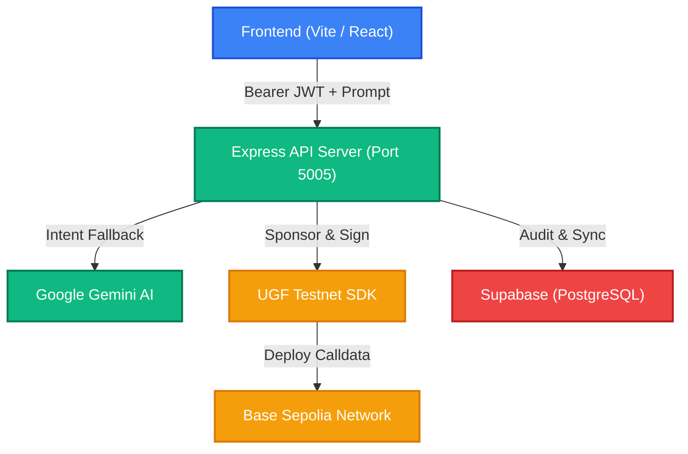

# Product Requirement Document (PRD): UGF AgentX

## 1. Executive Summary & Vision

**UGF AgentX** is a next-generation, AI-powered Web3 conversational assistant designed to make blockchain interaction as simple as chatting. Utilizing natural language, users can perform complex on-chain actions—such as minting achievement badges or sending crypto donations—without worrying about gas fees, seed phrases, or technical blockchain complexities.

By integrating the **Universal Gas Framework (UGF)**, the application sponsors transactions on behalf of the user on the **Base Sepolia** network. Gas is paid behind the scenes in **TYI Mock USD** by a server-side paymaster wallet, delivering a completely gasless, seamless "Web2.5" user experience.

---

## 2. Target Audience & Problem Statement

### The Problem
* **High Barrier to Entry**: To interact with dApps, users must acquire native gas tokens (e.g., ETH on Base Sepolia), set up browser extensions, and manually sign complex hex payloads.
* **Complex UI/UX**: Traditional Web3 wallets require users to understand concepts like gas limits, max priority fees, and calldata.
* **Lack of Natural Interface**: Command-line interfaces or complicated dashboards discourage casual Web3 users.

### The Solution: UGF AgentX
* **Conversational AI**: A simple chat prompt converts intent to smart contract execution.
* **100% Gasless**: Thanks to UGF, users don't need gas tokens or even native chain assets to perform transactions.
* **Safe & Guided UI**: Interactive timelines trace steps from conversational parsing to final block confirmation.

---

## 3. System Architecture & Tech Stack

### Core Technologies
* **Frontend**: React, Vite, TypeScript, TailwindCSS, Wagmi, ConnectKit, viem.
* **Backend**: Node.js, Express, TypeScript, `@tychilabs/ugf-testnet-js`, viem, ethers, jsonwebtoken.
* **Artificial Intelligence**: Google Gemini API (`@google/generative-ai`) for entity and intent extraction.
* **Database & Auth**: Supabase (PostgreSQL) for user, session, transaction, and gallery storage.

---

## 4. Functional Specifications & Core Features

### 4.1. Cryptographic Wallet Authentication
* **Requirement**: Users must log in securely using their Web3 wallets without traditional email/password credentials.
* **Mechanism**:
  1. The client registers their wallet address $\rightarrow$ Backend issues a cryptographically random UUID `nonce`.
  2. The client signs the nonce message using their private key.
  3. Backend verifies the signature with `viem` $\rightarrow$ issues a secure JWT token valid for 7 days.
* **API Endpoints**:
  * `POST /api/auth/nonce`
  * `POST /api/auth/verify`

### 4.2. Natural Language AI Chat & Intent Engine
* **Requirement**: The system must extract the user's intent and entities (recipient, amount, badge details) from natural language prompts.
* **Intents Supported**:
  * `MINT_BADGE` / `CLAIM_CERT`: Minting ERC-721 badges with custom metadata.
  * `DONATE` / `SEND_REWARD`: Executing gasless tokens/currency transfers.
  * `HELP` / `UNKNOWN`: Directing conversational fallback via Google Gemini.
* **API Endpoint**: `POST /api/chat` (Protected)

### 4.3. Gasless On-Chain Transaction Execution (UGF Integration)
* **Requirement**: On-chain smart contract transactions must be fully sponsored by the application.
* **Mechanism**:
  1. Parse prompt $\rightarrow$ encode target calldata (e.g., `mintBadge(to, tokenURI)`).
  2. Get gas quote in `TYI Mock USD` using UGF SDK.
  3. Settle gas from server gas vault $\rightarrow$ sign & submit sponsored tx payload.
  4. Poll status until confirmed $\rightarrow$ record tx hash in Supabase.
* **API Endpoint**: `POST /api/ugf/execute` (Protected)

### 4.4. Unified Session & Gallery Persistence
* **Requirement**: Persistent conversational history and blockchain assets must be visible to the user.
* **Features**:
  * Sidebar loaded with recent chat sessions and titles derived dynamically from the first message.
  * Gallery view displaying all successfully minted badges.
  * Auditable transaction logs detailing action types, gas fees, and on-chain explorer links.
* **API Endpoints**:
  * `GET /api/chat/sessions` (Protected)
  * `GET /api/chat/history/:id` (Protected)
  * `GET /api/gallery/:wallet` (Protected)
  * `GET /api/transactions/:wallet` (Protected)

---

## 5. Security & Privacy

* **No Server-Side Custody of User Keys**: User private keys are never transmitted to or stored on the backend. The backend signs transactions using its own dedicated paymaster private key to sponsor the user's actions.
* **JWT Integrity**: All private API endpoints are protected by `authMiddleware` which verifies the user's JWT signature and enforces that the target resources match the authenticated wallet address.
* **Database Isolation**: Row-Level Security (RLS) policies on Supabase prevent unauthorized access to other user's session data.

---

## 6. Implementation & Release Roadmap

### Phase 1: MVP Chat & Mock Execution (Completed)
* Express server setup with cors & logging.
* Cryptographic signature login (Nonce + JWT).
* Rule-based & Gemini fallback intent engine.
* Mock gas and timeline response engine.

### Phase 2: UGF & Smart Contract E2E Integration (In Progress)
* Deploy ERC-721 badge contract to Base Sepolia.
* Fund server-side paymaster wallet with `TYI Mock USD`.
* Integrate `@tychilabs/ugf-testnet-js` for quote/execution pipeline.
* Build automated E2E test client (`test-e2e.ts`).

### Phase 3: Mainnet Hardening & Production Release
* Implement Zod payload validation across all endpoints.
* Sync user balances directly from blockchain RPC.
* Polish interactive micro-animations and responsive wallet panel.
